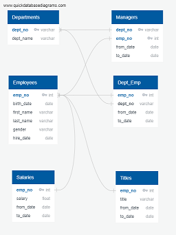
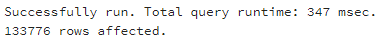
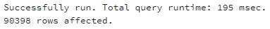
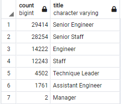
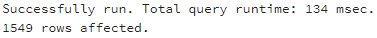

# Pewlett-Hackard-Analysis

## Overview

The "silver tsunami" analysis was created in order to better plan for the future of Pewlett-Hackard, based upon an aging work force approaching the retirement age. The particular aspects of the new analysis are as follows:

1. a list of possibly retiring employees whose birthday falls in between January 1, 1952 and December 31, 1955 was created. ***(Data/retirement_titles.csv)***

2.  the above list sorted by their most recent titles ***(Data/unique_titles.csv)***

3. a summary was created to show the total number of retirement-age employees for each title within the company. ***(Data/retiring_titles.csv)***

4. a list of employees born in 1965 who are elgibile for a mentorship program was created, so that they may help transition younger employees into higher roles within the company. ***(Data/mentorship_eligibilty.csv)***

---
## Resources
- CSV Files containing original data:
  - departments.csv, dept_emp.csv, dept_manager.csv, employees.csv, salaries.csv, titles.csv
- From those original files, a database was created using the following ERD as a reference:  
    

- The following four (**4**) SQL queries were used in this ananlysis

```
-- Create Retiring Employees by Title in retirement_titles table
-- (query 1)
SELECT e.emp_no,
	e.first_name,
	e.last_name,
	ti.title,
	ti.from_date,
	ti.to_date
INTO retirement_titles
FROM employees as e
INNER JOIN titles as ti
	ON (e.emp_no = ti.emp_no)
WHERE (e.birth_date BETWEEN '1952-01-01' AND '1955-12-31')
```  

```
-- Use Dictinct with Orderby to remove duplicate rows, into unique_titles table  
-- (query 2)
SELECT DISTINCT ON (emp_no) emp_no,
first_name,
last_name,
title
INTO unique_titles
FROM retirement_titles
ORDER BY emp_no, to_date DESC;
```

```
-- Create a retiring_titles table showing number of employees retiring by title  
-- (query 3)
SELECT COUNT(emp_no), title
INTO retiring_titles
FROM unique_titles
GROUP BY title
ORDER BY COUNT(emp_no) desc;
```

```
-- Create mentorship_elgibility table
-- (query 4)
SELECT DISTINCT ON (e.emp_no) e.emp_no,
	e.first_name,
	e.last_name,
	e.birth_date,
	de.from_date,
	de.to_date,
	ti.title
INTO mentorship_eligibilty
FROM employees AS e
	INNER JOIN dept_emp AS de
		ON (e.emp_no = de.emp_no)
	INNER JOIN titles AS ti
		ON (e.emp_no = ti.emp_no)
WHERE (de.to_date = '9999-01-01') 
	AND (e.birth_date BETWEEN '1965-01-01' AND '1965-12-31')
ORDER BY e.emp_no;
```

---
## Results
- Almost half of retirement-age employees have changed titles while working for the company (43,378 employees out of 90,398)  
<span style="color:red"><b>
  <-- the first query for total employees' titles  
 <-- the second query for most recent title  
</b></span>

- The senior positions (Senior Engineer and Senior Staff) far outnumber the other positions of eligible employees  
  

- Due to a low number of Assitant Engineers (1761, shown in image above), it can be resonably inferred that either most engineers move up in the company or leave for a better job elsewhere.  

- 1549 available mentors were indicated by the last query  
  

---

## Summary

- Using the current_emp table created in the database for this purpose, there are **33,118** currently employed people who are eligible for retirement soon. It is reasonable to assume a large majority of these roles will need to be filled in the near future.

- With only **1,549** current employees available for the mentoring program, and **33,118** positions to be filled soon, it would require each mentor to help approxiamately **21** new employees each. This number sounds a bit high, so immediate action and further analysis on this problem is most likely necessary.  
     

### SQL Queries for additional insight into this issue   


- This query returns the average salary for current retirement-age employees. The result is **$52,961.49**. This number could assist with future payroll planning.
```
SELECT CAST(AVG(salary) AS Money) 
FROM emp_info;
```
- The following query returns the name, title, and salary of the next group of workers to be eligible for retirement, with the birth date and hire date moved **3** years and **4** years forward, respectively, from the original group. It returns **28,308** rows. This could be used to help formulate a longer-term hiring strategy.
```
SELECT e.emp_no, 
	e.first_name, 
	e.last_name,
	ti.title,
	s.salary
FROM employees AS e
	JOIN dept_emp AS de
		ON (e.emp_no = de.emp_no)
	JOIN titles as ti
		ON (e.emp_no = ti.emp_no)
	JOIN salaries as s
		ON (e.emp_no = s.emp_no)
WHERE (e.birth_date BETWEEN '1956-01-01' AND '1958-12-31')
AND (e.hire_date BETWEEN '1989-01-01' AND '1992-12-31')
AND (de.to_date = '9999-01-01');
```